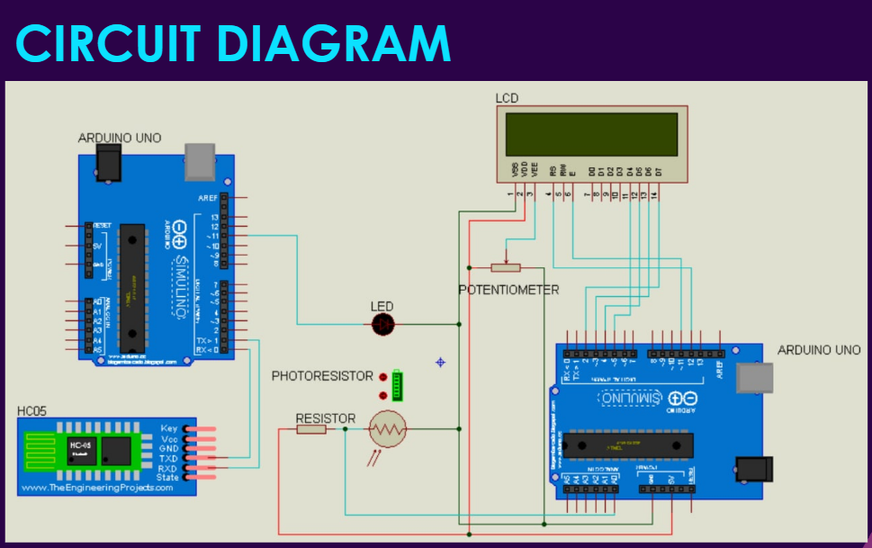

# LIFI Technology

This a project dedicated to transfer of data using light energy. It sends the data using the **LED light** and receives it using the **photoresistor**. The whole system is controlled by two arduinos - one controlling the sending of data and the other controlling the receiving of data.

## **Components Used:**

1. Arduino Uno x2
2. Photoresistor
3. LED
4. Jumper Cables
5. Bluetooth Module (HC05)
6. 16x2 LCD display
7. Potentiometer
8. Resistors

##### Link to Video Presentation:

https://drive.google.com/file/d/1vKF-nxCGvMt-EVkjGec5BtqCHv0bbA79/view?usp=sharing

## Circuit Diagram:

